# Spring Boot Rest API

## Part 2: Implementing the Tasks Microservice RESTFUL API

1. Create a new package called dto and inside define your TaskDto object with at least the following fields:

- name.
- description.
- status [TODO, DOING, REVIEW and DONE].
- assignedTo.
- dueDate.
- created.

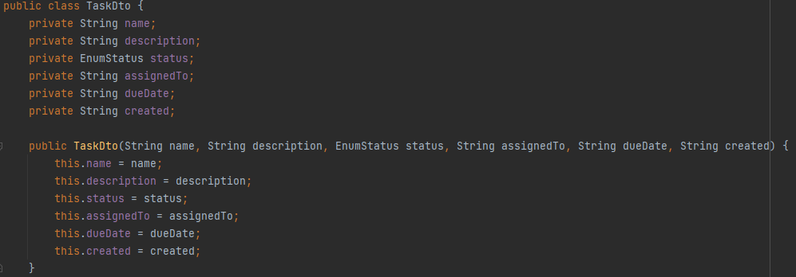

2. Create a new package called data and inside define your Task data object with at least the following fields:

- id.
- name.
- description.
- status [TODO, DOING, REVIEW and DONE].
- assignedTo.
- dueDate.
- created.

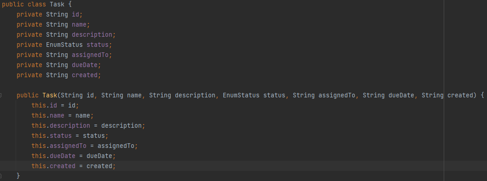

3. Create a new package called service an inside create the following interface:

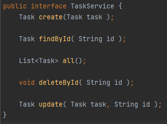

4. Create an implementation of the TaskService using a HashMap data structure inside.
Make your service implementation TaskServiceHashMap injectable using the @Service annotation.

5. Implement you TaskController (try to avoid copy paste, use the User Microservice as reference but try doing it consciously).

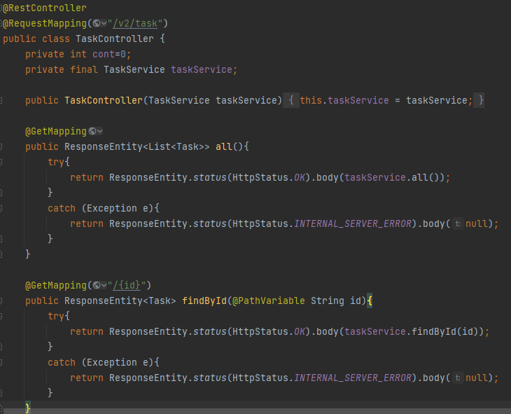

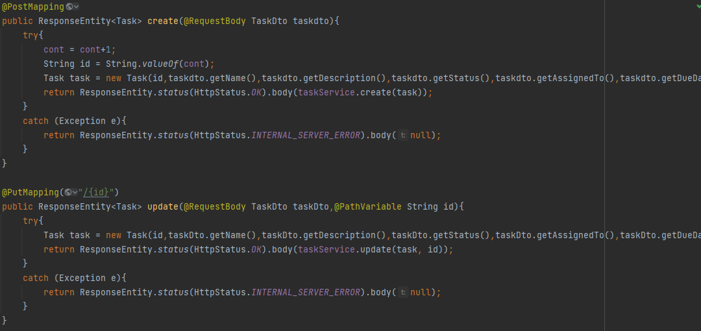

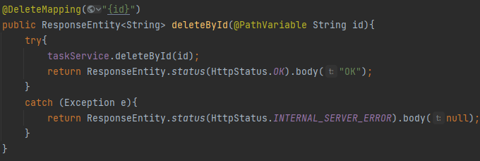

6. Test ALL the endpoints of your API using PostMan or any other tool of your preference.

### Post
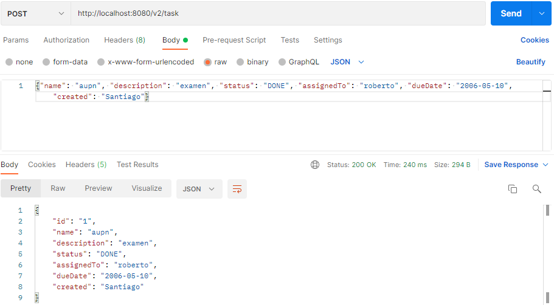
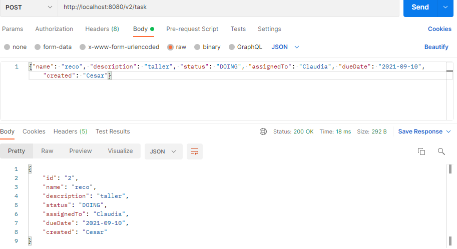

### Put
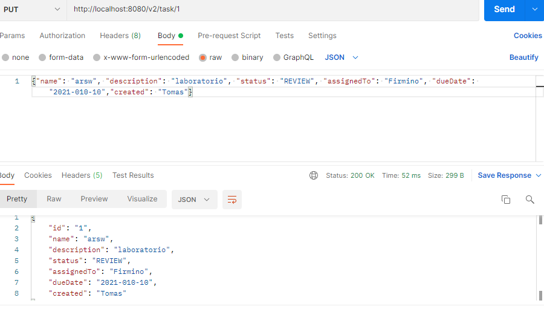

### Delete
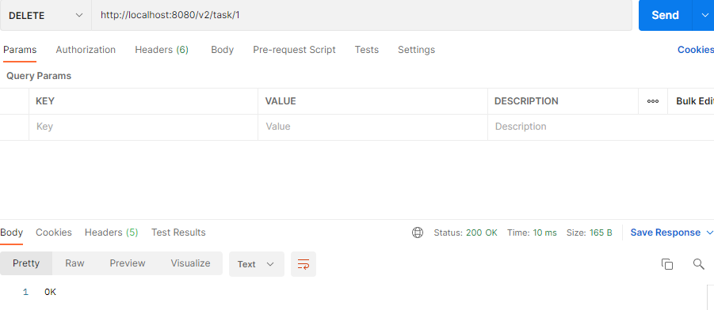

### Get
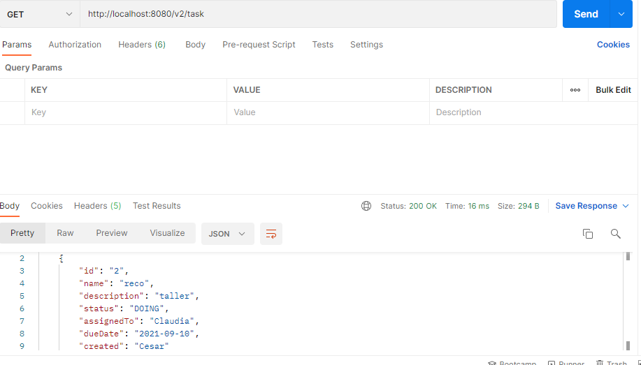

